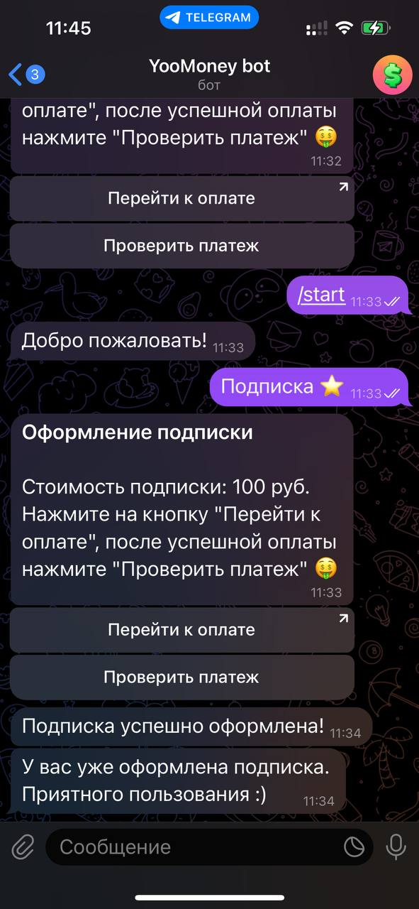

# Бот с оплатой через ЮMoney

## Краткое описание

Телеграм-бот для оплаты подписки через ЮMoney.



## Сборка

1. Склонируйте репозиторий: ```git clone github.com/everysoftware/yoomoney-bot```
2. Установите зависимости ```poetry install```
3. Получите токен ЮMoney: ```python -m app.token```
4. Создайте файл с конфигурацией `.env` на основе `.env.example`
5. Запустите бота: ```python -m app```
6. Готово!

Made with love ❤️